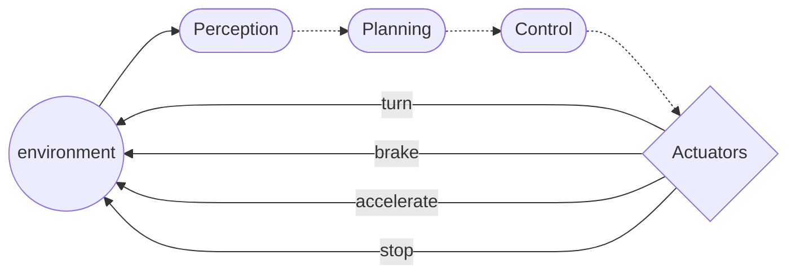

# Different Paradigms of AI in Robotics

1. Perception

    - _Making sense of what you see._
    - [Computer Vision](https://en.wikipedia.org/wiki/Computer_vision)

2. Planning

    - _Deciding what to do._
    - [Motion Planning](https://en.wikipedia.org/wiki/Motion_planning)
    - [Mapping and Localization](https://en.wikipedia.org/wiki/Simultaneous_localization_and_mapping)
    - [Reinforcement Learning](https://en.wikipedia.org/wiki/Reinforcement_learning)

3. Control

    - _Translating high-level decisions into "low-level" action-plans._
    - [Reinforcement Learning](https://en.wikipedia.org/wiki/Reinforcement_learning)

---
transition: slide-up
---

# Perception

- For example, an AV (autonomous vehicle) should:
  - Detect objects around it.
  - Classify them, so it knows what's going on.

A car in the way means a different thing than a pedestrian in the way.

---
transition: slide-up
---

# Planning

- Perception by itself is not enough.
- We need to react to our environment.

An agent such as an AV should be able to generate
a high-level plan of what to do given its environment.

For example, some cars can auto-adjust their speed or lane,
or even move back into the middle of their lane if they drift.

---
transition: slide-up
---

# Control

- Eventually, we need to move from a high-level plan to a lower-level action-plan
  that actuates that high-level plan.
  - For example, to avoid hitting a pedestrian, we need to:
    - Slow down.
    - Maybe, move to the side and stop.
    - Maybe, move steer into the road and avoid hitting the pedestrian, if stopping is not feasible.
  - For all these, we need to send precise commands to the car's actuators, such as:
    - Angle the steering wheel $45^0$ to the left.
    - Adjust gears to slow down.
    - Brake by a certain amount.
    - Other uninteresting things.

---

# Architecture

<!--  draw mermaid diagram of the three paradigms -->
  

---

# Ideas

1. Explore the three paradigms in more detail.
2. Explore how we can use existing models such as [GPT](https://openai.com/research/gpt-4) to generate plans.

    1. NOTE: GPT is text-based.
    2. What if we use a perception model to make sense of an image (into a textual description)
    3. Then feed that text into GPT to generate an action plan?

3. _How do we integrate such a model into a robot?_

    - Cannot run on-device.
    - Might host on the internet if we have internet hardware on the robot.
    - _But... in disaster scenarios, we might not have internet._

 

**THE END**

