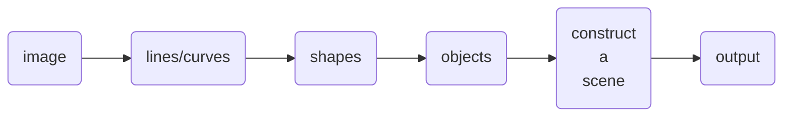

# Recap (last week)

1. **Explore the three paradigms in more detail.**
2. **Explore how we can use existing models such as [GPT](https://openai.com/research/gpt-4) to generate plans.**

    1. NOTE: GPT is text-based.
    2. What if we use a perception model to make sense of an image (into a textual description)
    3. Then feed that text into GPT to generate an action plan?

3. _How do we integrate such a model into a robot?_

    - Cannot run on-device.
    - Might host on the internet if we have internet hardware on the robot.
    - _But... in disaster scenarios, we might not have internet._

---
hideInToc: true
---

# More Detailed Look at Perception

Converting raw sensor data into useful signals.

- Cameras (RGB, IR, etc.)
- Lidar (Light Detection and Ranging)
- Radar (Radio Detection and Ranging)
- Sonar (Sound Navigation and Ranging)
- IMU (Inertial Measurement Unit)
  

  

  

- GPS

---
hideInToc: true
---

# Cameras (Computer Vision)

- Prominent use of neural networks since they have the capacity to holistically understand images.
- Here's a [good reference on neural networks](https://www.ibm.com/topics/neural-networks).

  

  

  

---

- Each neuron is just computing a linear-regression (weighted sum) of the input
  and then applying a non-linear activation function to the result.

$$
f_n(\^{x}) = \sigma \left( \sum_{i=1}^n W_{n_i} \cdot \^{x}_i + b_{n_i} \right)
$$

- The weights ($W$) and biases ($b$) are learned during training.  
   Make a prediction, [backpropagate](https://developer.ibm.com/articles/cc-cognitive-neural-networks-deep-dive/) and adjust weights, repeat. 
- Computing the function for all neurons at a single layer can be optimized to a bunch of matrix multiplications and additions.

---
hideInToc: true
---

# Black-Box Nature of Neural Networks

- We don't know how _exactly_ they work, and they do not
 offer any explanations (we can only speculate).
- Since such models are becoming more mainstream, there's a
  growing emphasis on [_explainability_](https://www.ibm.com/topics/explainable-ai).
  -  Explainability: ability to account for a model's prediction. 
- There's some [existing research work in this area](https://arxiv.org/pdf/1610.02391.pdf):

  

  

  

---

# Okay, then...

- Interested?
  - Come talk to me after the meeting.
  - _<highlight>No experience required.</highlight>_
  - Weekly team meet.
  - Baseline curriculum for new members (_and non-members!_) will be up soon.
  - Decide on project for this term,
    per member interests and what the other teams are working on.
- Create elaborate documentation of work we do, as a future reference.

 

**THE END**

